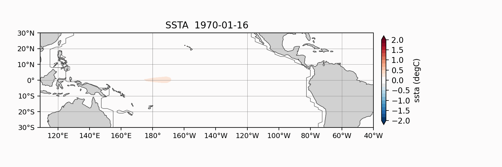

# Zebiak-Cane Type ENSO Model

This repository contains a Fortran implementation of a Zebiak-Cane type
intermediate coupled ocean-atmosphere model for tropical Pacific ENSO
experiments. It includes standalone ocean, standalone atmosphere, and coupled
model drivers, together with example namelists, grid files, forcing files, and
postprocessing notebooks.

The code is intended for research and experimentation. Exact scientific
configuration, validation status, and recommended default experiment should be
confirmed before using the model for publication-quality results.


## Model Overview

The repository provides four main executables:

- `exec_solver_ocn_dyn.out`: standalone ocean dynamical model forced by
  prescribed winds.
- `exec_solver_ocn_full.out`: standalone ocean model including the SST equation,
  forced by prescribed winds.
- `exec_solver_atm.out`: atmosphere/Gill-type response model forced by SST.
- `exec_solver_couple_full.out`: fully coupled ocean-atmosphere model.

The coupled configuration reads an ocean grid, an atmosphere grid, a coupler
mapping file, background ocean fields, SST and wind forcing files, and parameter
settings from a Fortran namelist. The available example namelists are mostly for
equatorial Pacific configurations (`eqpac`, `eqall`) and climatological or
annual-cycle background states.

## Example Visualization




## Repository Structure

```text
CODES/
  Fortran source files, Makefile, and generated executables/modules after build.

INPUT/
  Grid and coupling files.
  ATM/       Atmosphere grid files and grid-generation scripts.
  OCN/       Ocean grid, masks, topography, and grid-generation scripts.
  COUPLER/   Ocean-atmosphere coupler mapping files and generation scripts.

Forcing/
  External forcing and background fields, mostly NetCDF.
  OCN/       Ocean background fields and scripts to make mean fields.
  WIND/      Wind forcing files and wind preprocessing scripts.
  SST/       SST climatology/anomaly files and preprocessing scripts.
  Tzm/       Background vertical temperature-gradient fields.

RUN/
  Example namelist files for model execution.
  OGCM/      Standalone ocean runs.
  AGCM/      Standalone atmosphere runs.
  CGCM/      Coupled model runs.
  MIROC6/    Additional experiment files; purpose to be confirmed.
  Proj/      Project-specific coupled examples; purpose to be confirmed.

OUTPUTS/
  Example or generated NetCDF outputs, organized by model component.

GALLERY/
  Plotting notebooks and example figures.

ANALYSIS/
  Analysis scripts or outputs; contents and intended workflow to be confirmed.

MISC/
  Miscellaneous files; purpose to be confirmed.
```

## Requirements

Confirmed from the repository:

- A Fortran compiler. The provided `CODES/Makefile` uses `gfortran`.
- NetCDF C and NetCDF Fortran libraries. The Makefile links with
  `-lnetcdf -lnetcdff`.
- `make`.
- Python 3 for preprocessing and analysis scripts.
- Python packages used by scripts/notebooks are to be confirmed, but likely
  include `numpy`, `xarray`, `netCDF4`, `matplotlib`, and `jupyter`.

The Makefile currently contains local Homebrew paths such as:

```make
NETCDF_INCDIR=-I/opt/homebrew/Cellar/netcdf-fortran/4.6.1/include
NETCDF_LIBDIR=-L/opt/homebrew/Cellar/netcdf-fortran/4.6.1/lib -L/opt/homebrew/Cellar/netcdf/4.9.2_2/lib
```

These paths are machine-specific. New users will usually need to edit
`NETCDF_INCDIR` and `NETCDF_LIBDIR` for their environment.

## Build Instructions

From the repository root:

```bash
cd CODES
make -f Makefile
```

Expected executables:

```text
CODES/exec_solver_ocn_dyn.out
CODES/exec_solver_ocn_full.out
CODES/exec_solver_atm.out
CODES/exec_solver_couple_full.out
```

Useful Makefile targets:

```bash
make -f Makefile          # build all executables
make -f Makefile ogcm     # build standalone ocean executables
make -f Makefile agcm     # build standalone atmosphere executable
make -f Makefile clean    # remove generated objects, modules, and executables
```

Note: the `cgcm` target in the current Makefile appears to reference
`$(TARGET_cgcm)`, while the defined coupled target is
`$(TARGET_cgcm_full)`. Use `make -f Makefile` to build the coupled executable,
or confirm/fix the target name before relying on `make cgcm`.

## Running a Standalone Ocean Simulation

Start with a standalone ocean spin-up before running the coupled model. A
standard ocean example corresponding to the coupled example below is:

```text
RUN/OGCM/do_ogcm_spn_eqpac_30_cd013H120.nml
```

Run it from the repository root with:

```bash
mkdir -p OUTPUTS/OGCM
cd RUN/OGCM
../../CODES/exec_solver_ocn_dyn.out < do_ogcm_spn_eqpac_30_cd013H120.nml
```

This run writes an ocean average file and an ocean restart file under
`OUTPUTS/OGCM/`. See `RUN/OGCM/README.md` for the input and output files used
by this namelist.

The coupled example below is ordered after the standalone ocean example for a
standard workflow, but the current coupled namelist has `flag_ini_ocn="F"` and
does not directly read the OGCM restart file. How best to use OGCM spin-up
output when preparing new coupled experiments is to be confirmed.

The previous README described a workflow in which an OGCM spin-up is followed
by generating mean ocean background fields:

```bash
cd Forcing/OCN
python make_meanfield_ann.py   # fields without annual cycle
python make_meanfield_clm.py   # fields with annual cycle
```

The exact recommended spin-up/mean-field workflow for new experiments is to be
confirmed.

## Running a Standard Coupled Experiment

After the standalone ocean simulation, run the coupled model. A standard coupled
example available in the repository is:

```text
RUN/CGCM/do_cgcm_eqpac_30_ann_c1.4H120_dt3600_c10day.nml
```

This namelist runs an equatorial Pacific coupled configuration with annual-cycle
background/forcing files. Run it from the repository root with:

```bash
mkdir -p OUTPUTS/CGCM
cd RUN/CGCM
../../CODES/exec_solver_couple_full.out < do_cgcm_eqpac_30_ann_c1.4H120_dt3600_c10day.nml
```

The model writes progress information to standard output and NetCDF files to
the paths specified in the namelist. See `RUN/CGCM/README.md` for the input and
output files used by this namelist.

Runtime may be long because this example spans 1970-01-01 to 2020-01-01 with
`dt=3600.0`. For a quick smoke test, copy the namelist, shorten `end_yymmdd`,
and write to new output filenames so existing outputs are not overwritten.

## Standalone Atmosphere Example

A standalone atmosphere example is:

```bash
mkdir -p OUTPUTS/AGCM
cd RUN/AGCM
../../CODES/exec_solver_atm.out < do_agcm_hindcast_clm_256_ZC87.nml
```

## Required Input Files

Required files are defined by each namelist, not hard-coded globally. Before
running, inspect the selected `RUN/**/*.nml` file and verify that every listed
file exists.

Detailed input lists for the standard examples are documented with the
namelists:

- `RUN/OGCM/README.md`: standalone ocean input files.
- `RUN/CGCM/README.md`: coupled model input files.

In general, standalone ocean runs require an ocean grid file from `INPUT/OCN/`
and wind files from `Forcing/WIND/`. Coupled runs additionally require an
atmosphere grid, a coupler mapping file, background ocean fields, atmosphere SST
forcing, and ocean background/forcing files.

Some NetCDF forcing and output files in this working tree may be generated data
rather than version-controlled source files. Confirm which large files should be
shared with collaborators.

## Output Files

Output filenames are configured in each namelist. The standard standalone ocean
example writes `avg_*` and `rst_*` files under `OUTPUTS/OGCM/`; the standard
coupled example writes ocean average, ocean diagnostic, atmosphere average, and
ocean restart files under `OUTPUTS/CGCM/`.

Detailed output lists for the standard examples are documented in
`RUN/OGCM/README.md` and `RUN/CGCM/README.md`.

The meaning and units of all output variables should be confirmed from the
Fortran source and experiment documentation before scientific interpretation.

## Example Workflow

```bash
# 1. Clone and enter the repository.
git clone https://github.com/shokido/ZC_model
cd ZC_model

# 2. Edit CODES/Makefile if NetCDF include/library paths differ.
cd CODES
make -f Makefile

# 3. Run the standalone ocean spin-up example.
cd ..
mkdir -p OUTPUTS/OGCM
cd RUN/OGCM
../../CODES/exec_solver_ocn_dyn.out < do_ogcm_spn_eqpac_30_cd013H120.nml

# 4. Run the coupled example.
cd ../..
mkdir -p OUTPUTS/CGCM
cd RUN/CGCM
../../CODES/exec_solver_couple_full.out < do_cgcm_eqpac_30_ann_c1.4H120_dt3600_c10day.nml

# 5. Inspect results with notebooks in GALLERY/.
cd ../../GALLERY
jupyter lab
```

For a short test run, make a copy of the namelist first:

```bash
cd RUN/CGCM
cp do_cgcm_eqpac_30_ann_c1.4H120_dt3600_c10day.nml test_short.nml
```

Then edit `test_short.nml` to shorten the date range and change all output
filenames to avoid overwriting existing files.

## Known Limitations and Caveats

- The Makefile contains machine-specific NetCDF paths.
- The `make cgcm` target appears inconsistent with the defined coupled target;
  use the default `make -f Makefile` target unless this is corrected.
- The repository contains many generated files (`*.o`, `*.mod`, `*.out`, and
  NetCDF outputs) in the working tree. Decide which generated files should be
  shared or excluded before distributing the repository.
- There is no automated test suite currently documented.
- The exact validated/default experiment is to be confirmed.
- Units and scientific interpretation of several parameters and output
  variables should be confirmed from the source and/or publications.
- The model should not be described as a complete climate model; it is an
  intermediate Zebiak-Cane type ENSO model implementation.
- Reproducibility may depend on compiler, NetCDF library versions, and exact
  forcing files.

## References and Citation

Core reference:

- Zebiak, S. E., and M. A. Cane, 1987: A Model El Nino-Southern Oscillation.
  *Monthly Weather Review*, 115, 2262-2278.

If you use this repository in a publication or shared analysis, also cite this
code repository and record the commit hash, namelist file, compiler, NetCDF
versions, and input forcing files used.
